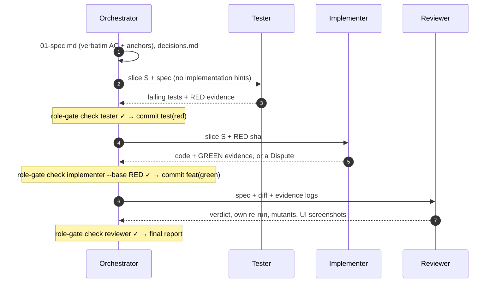
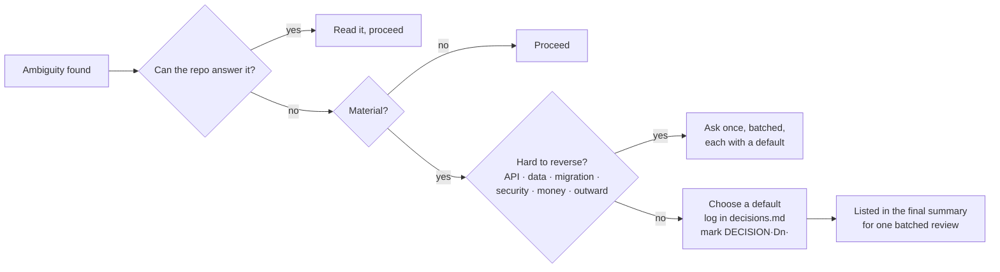
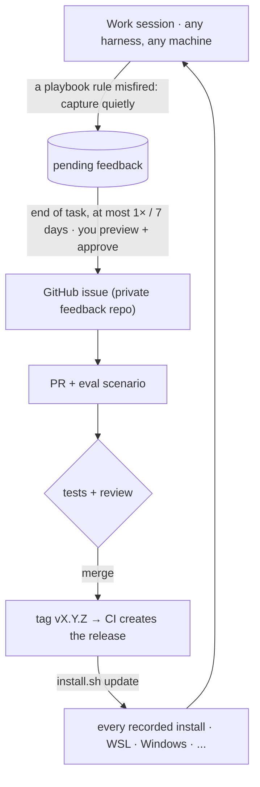

<div align="center">

# 🧭 agent-playbook

**AI SDLC, not AI slop.** One global skill pack for Claude Code, Codex and OpenCode.

   [](https://github.com/NLMDang22520190/agent-playbook/actions/workflows/test.yml)    

</div>

---

Agents write code fast, but **fast without verification turns into slop**: tests green on the wrong screen, "done" without a fresh run, code and tests written by the same agent and agreeing on the same mistake. agent-playbook puts discipline where every agent reads it: an **always-on** rule block in each harness's global instruction file, five skills used when they apply, and **mechanical gates** that check the work.

<p align="center">
  
</p>

## Philosophy

**1 · Clarify by reversibility.** Read the repo first. Ask only when an ambiguity is *both material and hard to reverse*. Otherwise pick a default, log it in `decisions.md`, keep going, and review the defaults in one batch at the end.

**2 · Proof for every claim.** Claims carry `[VERIFIED]`, `[INFERRED]` or `[UNVERIFIED]`. "Passes" needs the output of a run *from this session*.

**3 · Test author ≠ implementer ≠ reviewer.** Three roles, three fresh contexts, and `role-gate.sh` enforces it through git, not just through instructions.

**4 · Learn in the project, improve at the source.** Project lessons go to `LEARNINGS.md`. Gaps in the playbook itself become issues (you approve them), then a PR, a release, and every machine runs `update`.

### Every rule carries its why

| Rule | Why it exists |
|---|---|
| Ask when hard to reverse, otherwise log a default | Waiting on choices that can be undone kills speed; guessing the ones that cannot causes rework or damage. |
| Evidence from a fresh run | Tests have gone green on the wrong screen; a confident wrong explanation costs the next person a day. |
| Separate tester / implementer / reviewer | An agent that writes both the code and its tests writes tests that agree with its own mistakes. |
| Verbatim AC with source anchors | Paraphrasing a request is the fastest way to build what nobody asked for. |
| UI changes need someone to look | Green tests cannot tell you the screen is right. |
| Stay in scope, never loosen a gate | Unrequested changes hide in diffs nobody reviews. A loosened gate protects no one. |
| The playbook wins when skills overlap | Two skills giving opposite orders make behaviour random. |

## What's inside

| Component | Triggers | Does |
|---|---|---|
| `AGENTS.global.md` | **every session** (the installer puts it in the global instruction file) | clarify by reversibility · proof · scope · precedence |
| [`playbook-setup`](skills/playbook-setup/SKILL.md) | first run, or "set up the playbook" | detects the harness, reads the project, asks at most 8 questions with defaults |
| [`playbook-tdd`](skills/playbook-tdd/SKILL.md) | adding or changing behaviour, fixing a bug | anchored spec, RED → GREEN per slice, review, final report |
| [`playbook-proof`](skills/playbook-proof/SKILL.md) | reporting results or "done" | confidence labels, evidence by claim type, Definition of Done |
| [`playbook-learn`](skills/playbook-learn/SKILL.md) | when you correct the agent, or a gate fails with a known cause | project lessons in `.agents/LEARNINGS.md` (you approve) |
| [`playbook-feedback`](skills/playbook-feedback/SKILL.md) | when a playbook rule misfires or is missing | captures quietly, asks at most once at the end of a task, files an issue in your private feedback repo |

Scripts (bash 3.2+, no dependencies): `role-gate.sh` · `proof-run.sh` · `conf.sh` · `learn.sh` · `feedback.sh`.

## Three roles, one slice



| Role | May change | The gate fails when |
|---|---|---|
| Tester | test files only | production code is touched |
| Implementer | production code only | any test file is edited, deleted or added since the RED commit (test configuration counts as test) |
| Reviewer | nothing (report only) | anything in the repo changed |

### Weight by risk: not every change needs three sub-agents

| Weight | When | What runs | Measured cost* |
|---|---|---|---|
| **Full** | public API, data shape, migrations, security, money, core logic; or when unsure | three roles, three contexts, a gate after every hand-off, **one review per feature** | ~5 min and ~225k tokens for the three roles (the v0.3.1 fix) |
| **Lite** | small and reversible, ≤ 3 files and ≤ 100 lines (`role-gate.sh size` checks it) | one context: test written first and seen failing, `role-gate --base RED`, evidence; no reviewer | test-first plus the gate |
| **Exempt** | docs, config that does not change behaviour, throwaway spikes | no new tests, but say so explicitly | negligible |

Lite **escalates to Full** when it touches hard-to-reverse ground, outgrows the size limit, or a test looks wrong. Configuration that changes behaviour (feature flags, defaults, permissions, deploy settings) is **not exempt**.
<sub>* Measured on the v0.3.1 fix, see the CHANGELOG. Not a benchmark.</sub>

### Spending tokens where they buy safety

- **A model per role, per harness.** Setup lists the models your harness offers and recommends: a strong model (or another vendor) for the reviewer, mid-tier for the implementer, mid- or low-tier for the tester; you accept or pick. `scripts/role-model.sh <role> --harness <h>` resolves it (`model_<role>_<harness>` → `model_<role>` → `session`).
- **Focused tests in sub-agents,** one fresh full run (test, lint, typecheck) by the orchestrator at close-out.
- **The reviewer's checklist is in the tester's prompt** ("make every check able to fail"), so fewer review rounds come back.
- **Cohesive slices** of 1–5 tests, and every sub-agent prompt built from `templates/role-prompt.md` (fixed text first) so prompt caching can reuse it.
- **Mechanical steps are scripts:** `scripts/tdd-step.sh red|green` (gate + evidence + optional commit), `tools/release.sh` for maintainers.
- **Cost is measured:** `scripts/cost.sh add` per role run, `cost.sh summary` in the final report. v0.6.0 itself: 11 sub-agent runs, 891k tokens (tester and implementer on Sonnet, reviewer on Opus).

If the harness has sub-agents, each role is a sub-agent. If not, each role runs as a separate headless session. With a single context only, it still runs, but the report says so: it is the weaker mode.

## Ask or decide?



## Install once, run in every harness

<p align="center">
  
</p>

| Harness | Skills | Always-on rules |
|---|---|---|
| Claude Code | `~/.claude/skills/playbook-*` | managed block in `~/.claude/CLAUDE.md` |
| Codex CLI | `~/.agents/skills/playbook-*` | managed block in `~/.codex/AGENTS.md` |
| OpenCode | reads both folders above | `~/.config/opencode/AGENTS.md`, or falls back to the Claude file |

```bash
git clone https://github.com/NLMDang22520190/agent-playbook.git ~/agent-playbook
cd ~/agent-playbook && bash tests/run-all.sh                 # must be green
./install.sh install --harness all --dry-run                 # preview
./install.sh install --harness all --yes && ./install.sh doctor
```

**Windows.** Two supported setups, both verified on Windows 11:
- *Without WSL* (needs [Git for Windows](https://git-scm.com/download/win)): clone anywhere and run `.\install.ps1 install -Harness claude,codex,opencode -Yes` from PowerShell. It finds Git Bash itself and installs in copy mode (Windows does not grant symlink rights by default). Re-run it after each `git pull`, or use `update` from Git Bash.
- *Repo inside WSL, harness on Windows*: `./install.sh install --home /mnt/c/Users/<name> --harness all --copy --yes`.

Caveat: in PowerShell, `bash` usually resolves to `C:\Windows\System32\bash.exe`, which is the **WSL launcher**, not Git Bash. Agents on Windows should run the playbook scripts with Git Bash (`"C:\Program Files\Git\bin\bash.exe" ~/.agents/playbook/scripts/...`); Claude Code's own shell tool already is Git Bash.

The installer is safe to re-run, backs files up before changing them, never overwrites anything it does not own, and records every target so `update` refreshes them all. Then open a **new session** and say *"set up the playbook"*.

## Improves itself from real use



```bash
./install.sh update --check             # is there a newer release?
./install.sh update --yes               # show the CHANGELOG, check out the tag, re-install everywhere, doctor
./install.sh update --to v0.2.0 --yes   # roll back
```

`feedback.sh submit` refuses to post to a public repository (or one whose visibility it cannot read) unless you pass `--allow-public`. Details: [`docs/update-lifecycle.md`](docs/update-lifecycle.md).

## Behaviour evals

Script tests prove the tools work; only behaviour evals show whether an agent actually follows the rules.
`evals/run-evals.sh` runs scenarios E1, E3, E8 and E15 against a real harness in throw-away fixtures, grades the mechanical part (PASS / FAIL / MANUAL per check) and writes a results file:

```bash
evals/run-evals.sh --harness opencode --scenarios E1,E15,E8 --workroot /tmp/pb-evals-$(date +%s)
evals/run-evals.sh --cmd "bash my-adapter.sh" ...   # adapter is called as: COMMAND <workdir> <prompt-file>
```

The presets do not sandbox the agent (the opencode preset auto-approves its actions): run them only in a throw-away workroot or a VM, never inside a real repo. Score the MANUAL items with [`evals/RUBRIC.md`](evals/RUBRIC.md).

## Quality, measured

| Metric | Value | Source |
|---|---|---|
| Script, installer and tool tests | **1766 passing** (see `bash tests/run-all.sh`) | `bash tests/run-all.sh`, WSL Ubuntu 24.04 |
| Static checks | frontmatter (incl. YAML parse), length budgets, a why for every rule, CRLF, syntax, shellcheck, evals | `evals/run-checks.sh` |
| Always-on block | 44 / 60 lines · 4,698 / 5,000 bytes | `wc -l -c AGENTS.global.md` |
| Skill descriptions | 1,372 / 2,000 characters (Codex truncates long skill lists) | `run-checks.sh` |
| CI | Ubuntu (bash 5, shellcheck) + macOS (bash 3.2, BSD tools) + Windows (Git Bash, copy mode) on every push and PR; release job on `v*` tags | `.github/workflows/test.yml` |
| Behaviour scenarios E1–E19 | Claude Code 2.1.296, three rounds with v0.13.0 wording: E3 3/3 and E8 3/3 auto checks every round (E8 names the injected instruction), E1 4/4 when graded; playbook-tdd loaded in every E1 ([results](evals/results/2026-10-10-claude-code-2.1.296.md)). Other scenarios and harnesses not run yet | [`evals/scenarios.md`](evals/scenarios.md) · [`RUBRIC.md`](evals/RUBRIC.md) |

A metric that was not measured is not a metric.

## Alongside Superpowers or other skill packs

The always-on block has a *When other skills overlap* section. When it conflicts with `test-driven-development`, `subagent-driven-development` or `brainstorming`, these rules win: separate tester / implementer / reviewer, the reviewer re-runs the tests, and questions are batched in one message with defaults. Scenario E11 checks this.

## Limitations (stated plainly)

- Fresh contexts on the same model still share blind spots. Prefer a different model for the reviewer.
- `role-gate.sh` tells tests from code by path (configurable regex). It cannot catch an implementer special-casing test inputs in production code; the reviewer and the mutation spot-check do that.
- Rules written in prose (ask, attach evidence) depend on the model following them. The gates only enforce the mechanical part.
- Codex only has sub-agents with its multi-agent feature enabled; otherwise the playbook runs in `manual` mode.

## Repository layout

```
agent-playbook/
├── AGENTS.global.md        always-on rules (the installer puts them in each harness's global file)
├── skills/                 setup · tdd (roles/, templates/, references/) · proof · learn · feedback
├── scripts/                role-gate · proof-run · conf · learn · feedback · lib
├── templates/LEARNINGS.md
├── install.sh / install.ps1
├── tests/                  1766 tests, run in sandboxes, never touch the real HOME
├── evals/                  run-evals.sh (headless evals) · run-checks.sh · scenarios.md (E1–E19) · RUBRIC.md · make-fixture.sh
├── tools/                  setup-labels.sh (feedback issue labels) · check-release.sh (VERSION + CHANGELOG per tag)
└── docs/                   flow.svg · architecture.svg · tdd-for-beginners.md · harness-notes.md · update-lifecycle.md
```

```bash
./install.sh uninstall --harness all --yes   # removes only what the installer created; keeps config and backups
```

## Credits

The content is written for this repo. Ideas were learned from:
- [obra/superpowers](https://github.com/obra/superpowers): TDD discipline and "evidence before claims".
- [Agent Skills](https://agentskills.io) and [AGENTS.md](https://agents.md): the open formats that let one skill pack run across harnesses.
- [forrestchang/andrej-karpathy-skills](https://github.com/forrestchang/andrej-karpathy-skills): surgical changes, stated assumptions.
- [mattpocock/skills](https://github.com/mattpocock/skills): concise skill writing.
- An internal B2B delivery playbook: decide by reversibility, a why for every rule, verbatim AC with anchors, and looking at the UI.

## License

[MIT](LICENSE)

---

<div align="center">
<sub>agent-playbook · alpha · TDD guide for beginners: <a href="docs/tdd-for-beginners.md">docs/tdd-for-beginners.md</a> · Harness notes with sources: <a href="docs/harness-notes.md">docs/harness-notes.md</a></sub>
</div>
