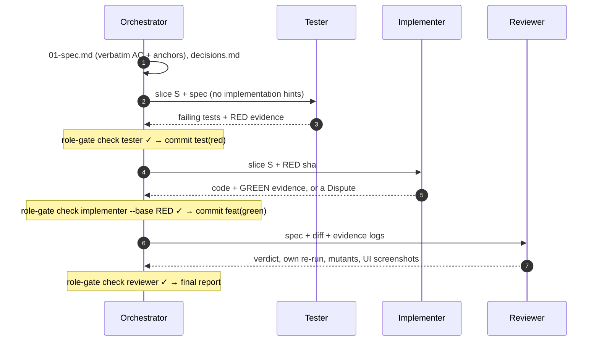
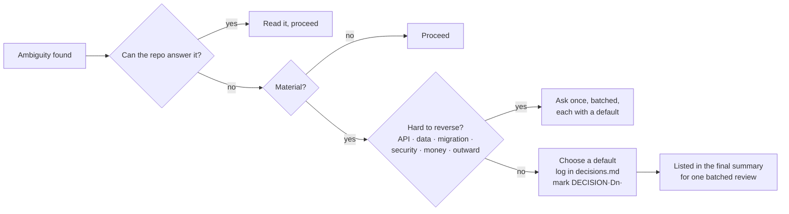
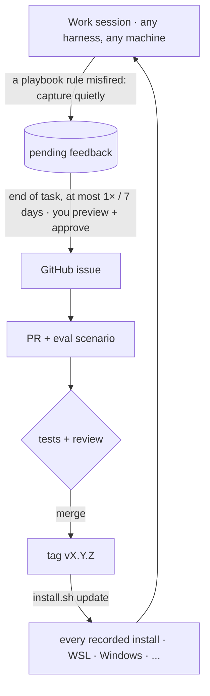

<div align="center">

# 🧭 agent-playbook

**AI SDLC, không phải AI slop.** Một bộ skill global dùng chung cho Claude Code, Codex và OpenCode.

  [](https://github.com/NLMDang22520190/agent-playbook/actions/workflows/test.yml)    

</div>

---

Agent viết code rất nhanh, nhưng **nhanh mà không kiểm chứng thì thành slop**: test xanh trên màn hình sai, "xong rồi" mà chưa chạy lại, code và test do cùng một agent viết nên đồng ý với cùng một lỗi. agent-playbook đặt kỷ luật vào chỗ agent nào cũng đọc: một khối luật **luôn bật** trong file global của harness, năm skill dùng khi cần, và các **gate bằng máy** để kiểm chứng.

<p align="center">
  
</p>

## Triết lý

**1 · Làm rõ theo khả năng đảo ngược.** Đọc repo trước. Chỉ hỏi khi điểm mơ hồ *vừa quan trọng vừa khó đảo ngược*. Còn lại thì chọn mặc định, ghi vào `decisions.md`, đi tiếp và duyệt gộp ở cuối.

**2 · Bằng chứng cho mọi khẳng định.** Mỗi khẳng định có nhãn `[VERIFIED]` `[INFERRED]` `[UNVERIFIED]`. "Pass" phải có output của một lần chạy *trong phiên này*.

**3 · Người viết test ≠ người viết code ≠ người review.** Ba vai, ba ngữ cảnh mới, và `role-gate.sh` chặn bằng git, không chỉ dặn bằng lời.

**4 · Học ở dự án, cải thiện ở gốc.** Bài học riêng của dự án vào `LEARNINGS.md`. Lỗ hổng của chính playbook thành issue (bạn duyệt), PR, release, rồi mọi máy `update`.

### Mỗi luật kèm lý do

| Luật | Vì sao có luật này |
|---|---|
| Hỏi khi khó đảo ngược, còn lại thì ghi mặc định | Chờ những quyết định đảo ngược được làm chết tốc độ; đoán những quyết định không đảo ngược được gây làm lại hoặc gây hại. |
| Bằng chứng từ lần chạy mới | Test từng xanh trên màn hình sai; một lời giải thích sai nhưng tự tin tốn của người sau cả ngày. |
| Tách tester / implementer / reviewer | Agent tự viết cả code lẫn test sẽ viết test đồng ý với lỗi của chính nó. |
| AC nguyên văn kèm anchor nguồn | Diễn giải lại yêu cầu là cách nhanh nhất để làm đúng thứ không ai yêu cầu. |
| UI phải có người mở màn hình | Test xanh không cho biết màn hình có đúng hay không. |
| Giữ phạm vi, không nới gate | Sửa ngoài yêu cầu trốn trong diff mà không ai review. Gate bị nới thì không còn bảo vệ ai. |
| Playbook thắng khi skill khác chồng chéo | Hai skill ra lệnh ngược nhau thì hành vi thành ngẫu nhiên. |

## Bên trong có gì

| Thành phần | Kích hoạt | Làm gì |
|---|---|---|
| `AGENTS.global.md` | **mọi phiên** (installer chèn vào file global) | làm rõ theo khả năng đảo ngược · bằng chứng · phạm vi · thứ tự ưu tiên |
| [`playbook-setup`](skills/playbook-setup/SKILL.md) | lần đầu, hoặc "set up the playbook" | nhận diện harness, đọc dự án, hỏi tối đa 8 câu có mặc định |
| [`playbook-tdd`](skills/playbook-tdd/SKILL.md) | thêm hoặc sửa hành vi, sửa bug | spec có anchor, RED → GREEN theo lát, review, báo cáo cuối |
| [`playbook-proof`](skills/playbook-proof/SKILL.md) | khi báo kết quả hoặc "xong" | nhãn tin cậy, bảng bằng chứng theo loại, Definition of Done |
| [`playbook-learn`](skills/playbook-learn/SKILL.md) | khi bị sửa, khi gate fail có nguyên nhân | bài học cho dự án vào `.agents/LEARNINGS.md` (bạn duyệt) |
| [`playbook-feedback`](skills/playbook-feedback/SKILL.md) | khi luật của playbook sai hoặc thiếu | ghi lặng lẽ, cuối task hỏi tối đa 1 lần, rồi tạo issue |

Script (bash 3.2+, không phụ thuộc gì): `role-gate.sh` · `proof-run.sh` · `conf.sh` · `learn.sh` · `feedback.sh`.

## Ba vai, một slice



| Vai | Được sửa | Gate chặn khi |
|---|---|---|
| Tester | chỉ file test | đụng vào code sản phẩm |
| Implementer | chỉ code sản phẩm | sửa, xoá hoặc thêm bất kỳ file test nào kể từ commit RED |
| Reviewer | không gì cả (chỉ báo cáo) | repo có bất kỳ thay đổi nào |

### Mức độ theo rủi ro: không phải việc nào cũng cần 3 sub-agent

| Mức | Khi nào | Chạy gì | Chi phí đo được* |
|---|---|---|---|
| **Full** | API công khai, cấu trúc dữ liệu, migration, bảo mật, tiền, logic lõi; hoặc khi phân vân | 3 vai, 3 ngữ cảnh, gate sau mỗi lần bàn giao, **một review cho cả tính năng** | ~5 phút và ~225k token cho 3 vai (bản sửa v0.3.1) |
| **Lite** | sửa nhỏ, đảo ngược được, ≤ 3 file và ≤ 100 dòng | một ngữ cảnh: test viết trước và thấy đỏ, `role-gate --base RED`, bằng chứng; không có reviewer | chỉ phần test trước và gate |
| **Exempt** | docs, config không đổi hành vi, spike bỏ đi | không thêm test, nhưng phải nói rõ là được miễn | không đáng kể |

Lite **tự nâng lên Full** khi đụng tới vùng khó đảo ngược, vượt giới hạn kích thước, hoặc nghi ngờ một test sai. Config làm đổi hành vi (feature flag, giá trị mặc định, phân quyền, deploy) **không được miễn**.
<sub>* Số đo từ bản sửa v0.3.1, xem CHANGELOG. Chưa phải benchmark.</sub>

Harness có sub-agent thì mỗi vai là một sub-agent. Nếu không có thì mỗi vai chạy thành một phiên headless riêng. Trường hợp chỉ có một ngữ cảnh thì vẫn chạy được nhưng **được báo rõ** là chế độ yếu.

## Hỏi hay tự quyết?



## Cài một lần, chạy ở mọi harness

<p align="center">
  
</p>

| Harness | Skills | Luật luôn bật |
|---|---|---|
| Claude Code | `~/.claude/skills/playbook-*` | khối được quản lý trong `~/.claude/CLAUDE.md` |
| Codex CLI | `~/.agents/skills/playbook-*` | khối được quản lý trong `~/.codex/AGENTS.md` |
| OpenCode | đọc sẵn cả hai thư mục trên | `~/.config/opencode/AGENTS.md`, hoặc fallback sang file của Claude |

```bash
git clone https://github.com/NLMDang22520190/agent-playbook.git ~/agent-playbook
cd ~/agent-playbook && bash tests/run-all.sh                 # phải xanh
./install.sh install --harness all --dry-run                 # xem trước
./install.sh install --harness all --yes && ./install.sh doctor
```

**Windows, khi repo nằm trong WSL:** `./install.sh install --home /mnt/c/Users/<tên> --harness all --copy --yes`. Nếu repo nằm thẳng trên Windows thì dùng `.\install.ps1 install -Harness claude -Yes`.

Installer chạy lặp lại an toàn, sao lưu file trước khi sửa, không ghi đè thứ gì không phải của nó, và ghi lại mọi nơi đã cài để `update` cập nhật hết. Xong thì mở **phiên mới** và nói *"set up the playbook"*.

## Tự cải thiện từ việc dùng thật



```bash
./install.sh update --check      # có bản mới không?
./install.sh update --yes        # hiện CHANGELOG, checkout tag, cài lại mọi nơi, doctor
./install.sh update --to v0.2.0 --yes   # lùi bản
```

Chi tiết: [`docs/vong-doi-cap-nhat.md`](docs/vong-doi-cap-nhat.md).

## Chất lượng, đo được

| Chỉ số | Giá trị | Nguồn |
|---|---|---|
| Test script, installer và công cụ | **532 passing** (conf 16 · evals 151 · feedback 82 · install 69 · learn 27 · proof-run 22 · release 22 · role-gate 83 · run-checks 13 · update 47) | `bash tests/run-all.sh`, WSL Ubuntu 24.04 |
| Kiểm tra tĩnh | frontmatter, ngân sách độ dài, lý do của mỗi luật, CRLF, cú pháp, eval | `evals/run-checks.sh` |
| Khối luôn bật | 40 / 60 dòng · 4.369 / 5.000 byte | `wc -l -c AGENTS.global.md` |
| Description các skill | 1.541 / 2.000 ký tự (Codex cắt danh sách skill quá dài) | `run-checks.sh` |
| CI | Ubuntu (bash 5, shellcheck) + macOS (bash 3.2, BSD tools), mỗi push và PR; xem badge CI | `.github/workflows/test.yml` |
| Kịch bản hành vi E1–E17 | *pending*: `evals/run-evals.sh` chấm tự động E1/E3/E8/E15; lần chạy thật đầu tiên (OpenCode) bị chặn vì API key không hợp lệ | [`evals/scenarios.md`](evals/scenarios.md) · [`RUBRIC.md`](evals/RUBRIC.md) |

Chỉ số nào chưa đo thì không được coi là chỉ số.

## Khi cài cùng Superpowers hoặc skill khác

Khối luôn bật có mục *When other skills overlap*. Khi xung đột với `test-driven-development`, `subagent-driven-development` hoặc `brainstorming`, các luật sau luôn thắng: tách vai tester / implementer / reviewer, reviewer tự chạy lại test, và hỏi gộp một lượt có mặc định. Kịch bản E11 kiểm tra điều này.

## Giới hạn (nói thẳng)

- Ngữ cảnh mới nhưng cùng một model thì vẫn có điểm mù chung. Nên dùng model khác cho reviewer.
- `role-gate.sh` phân loại test hay code theo đường dẫn (regex chỉnh được). Nó không bắt được việc implementer viết code riêng cho input của test; reviewer và mutation spot-check làm việc đó.
- Luật viết bằng chữ (hỏi lại, đính kèm bằng chứng) phụ thuộc vào việc model có tuân thủ. Gate chỉ cưỡng chế được phần cơ học.
- Codex chỉ có sub-agent khi bật tính năng multi-agent. Nếu không, playbook chạy ở chế độ `manual`.

## Cấu trúc repo

```
agent-playbook/
├── AGENTS.global.md        luật luôn bật (installer chèn vào file global của harness)
├── skills/                 setup · tdd (roles/, templates/, references/) · proof · learn · feedback
├── scripts/                role-gate · proof-run · conf · learn · feedback · lib
├── templates/LEARNINGS.md
├── install.sh / install.ps1
├── tests/                  532 test, chạy trong sandbox, không đụng HOME thật
├── evals/                  run-evals.sh (chạy eval headless) · run-checks.sh · scenarios.md (E1–E17) · RUBRIC.md · make-fixture.sh
├── tools/setup-labels.sh   nhãn cho issue feedback
└── docs/                   flow.svg · architecture.svg · tdd-huong-dan.md · harness-notes.md · vong-doi-cap-nhat.md
```

```bash
./install.sh uninstall --harness all --yes   # chỉ gỡ những gì installer tạo; giữ cấu hình và backup
```

## Ghi công

Nội dung do repo này tự viết. Các ý tưởng được học hỏi từ:
- [obra/superpowers](https://github.com/obra/superpowers): kỷ luật TDD và "evidence before claims".
- [Agent Skills](https://agentskills.io) và [AGENTS.md](https://agents.md): các định dạng mở giúp một bộ skill chạy được trên nhiều harness.
- [forrestchang/andrej-karpathy-skills](https://github.com/forrestchang/andrej-karpathy-skills): thay đổi đúng chỗ, nêu rõ giả định.
- [mattpocock/skills](https://github.com/mattpocock/skills): cách viết skill gọn.
- Một playbook giao hàng B2B nội bộ: quyết định theo khả năng đảo ngược, mỗi luật kèm lý do, AC nguyên văn có anchor, và kiểm tra UI bằng mắt.

## License

[MIT](LICENSE)

---

<div align="center">
<sub>agent-playbook · alpha · Hướng dẫn TDD cho người mới: <a href="docs/tdd-huong-dan.md">docs/tdd-huong-dan.md</a> · Ghi chú harness kèm nguồn: <a href="docs/harness-notes.md">docs/harness-notes.md</a></sub>
</div>
